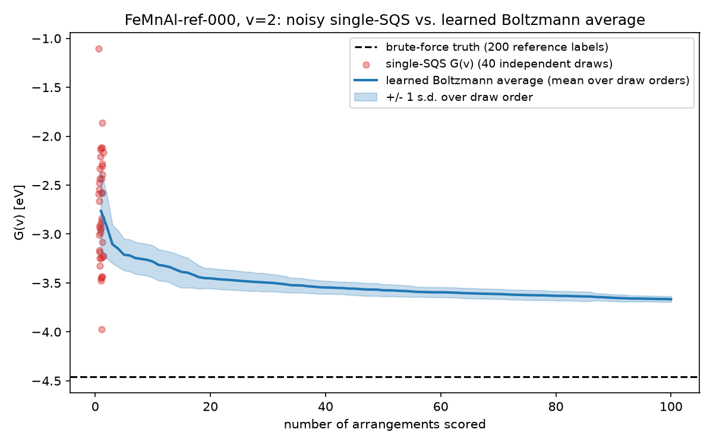

# vacancy-gnn

[](https://github.com/alfredjo00/vacancy-gnn/actions/workflows/ci.yml)


Estimating an expensive expectation with a learned surrogate instead of a
single noisy sample: an E(3)-equivariant GNN learns per-configuration energies,
and Boltzmann-weighted averaging over its cheap predictions replaces one
expensive, high-variance draw. The testbed is a real materials problem:
**low-noise Gibbs free energies** for oxygen vacancies in high-entropy oxides.

## The problem

To predict the Gibbs free energy `G(v)` of a high-entropy oxide at oxygen-vacancy
level `v`, the standard approach relaxes one special quasi-random structure (SQS)
per level with a machine-learning interatomic potential. But at nonzero `v` there
are `C(48, v)` distinct places to put the vacancies, and their energies genuinely
differ: a vacancy next to a reducible cation (Cu, Mn, Fe) costs very differently
than one buried in an Al/Ti pocket. In the MACE-labeled dataset here, arrangements
at the same `(composition, v)` spread over **1.0-1.3 eV**, so a single SQS draw is
a one-sample estimate of a wide distribution, noisiest exactly where it matters
(high `v`, reducing conditions).

The physically correct quantity is not one draw, nor the single lowest arrangement,
but the **Boltzmann-weighted configurational average**:

```
G(v; T) = -k_B T ln  sum_i exp(-E_i / k_B T)
```

This package learns per-arrangement vacancy energies with an equivariant GNN and
computes that average from model predictions, so every extra arrangement folded
into the sum is free instead of one more relaxation.

> Why the average and not just the lowest-energy arrangement? The minimum is the
> `T -> 0` limit of the expression above; at reactor temperatures (1223-1323 K) the
> configurational entropy is not negligible and taking the minimum biases rankings.



Single-SQS draws (red) scatter over several eV; the GNN's Boltzmann average
(blue) tightens within a few arrangements and lands about 0.2 eV from the
brute-force truth (dashed, 60 oracle labels), using 8 oracle calls for offset
calibration instead of 480. The composition was **held out from training**. See
[`notebooks/01_money_figure.ipynb`](notebooks/01_money_figure.ipynb) for the
full, reproducible walkthrough.

## Measured results (real data, held-out compositions)

Data: 32 spinel compositions relaxed with MACE-MPA-0 by the offline factory in
`scripts/` (30 for training with 40 arrangements each; 2 held out and sampled
densely, 60 arrangements per `(composition, v)`, as brute-force reference).

| Metric (held-out compositions) | Linear baseline | Equivariant GNN |
|---|---|---|
| Per-arrangement MAE, offset-corrected | 1.44 eV | **1.12 eV** |
| Within-`(composition, v)` MAE vs 1.02/1.32 eV label spread | 1.13/1.35 eV (chance) | **0.81/0.96 eV** |
| Arrangement ranking (Spearman within groups) | +0.25/+0.28 | **+0.44/+0.45** |

Reported honestly rather than tuned away:

- On an unseen composition the model's absolute energies carry a near-constant
  **per-composition offset** (a few eV): the linear composition reference must
  extrapolate to the new species mix. Every physics deliverable (Boltzmann
  weights, ranking, `Delta G` across `v`) is invariant to that constant, and one
  oracle label per vacancy level pins it; the `evaluate` CLI reports raw and
  offset-corrected parity side by side.
- Compositions **outside the training hull** are where the reference genuinely
  fails (offsets reached -88 to -168 eV on an earlier, narrower dataset). The
  package detects this instead of hiding it: `evaluate` flags out-of-hull
  compositions, and the factory's `--preflight` checks coverage before any GPU
  time is spent.
- The per-arrangement ranking is useful but far from perfect at this data
  scale; averaging is what buys the tight `G(v)`.
- Everything assumes vacancy configurations equilibrate at reactor temperature;
  frozen kinetics would make any configurational average an approximation.

## Status

Done so far: the thermodynamics
core, data layer, linear baseline, the dependency-light E(3)-equivariant GNN
(PaiNN-style, no e3nn/torch_geometric), the evaluation harness (brute-force
reference, parity, oracle-efficiency, min-vs-average, T-sweeps), and the
offline MACE data factory with full-scale retraining on its export. Remaining:
release polish and the dataset asset.

The GNN needs the optional `ml` extra (`pip install -e ".[ml]"`, which pulls in
torch); the rest of the package installs and runs without it, so CI stays green
both with and without torch. Reproducing the money figure notebook needs the
`viz` extra (matplotlib) plus Jupyter and the full dataset, which is attached
to the GitHub release along with the trained checkpoint; see
[`data/README.md`](data/README.md) for download and provenance.

## Quickstart

```bash
pip install -e ".[dev]"
pytest

# Boltzmann-averaged free energy over a few arrangement energies (eV):
vacancy-gnn gibbs -e -4.0,-2.0,1.0 --temperature 1323
# At T -> 0 it reduces to the lowest arrangement:
vacancy-gnn gibbs -e -4.0,-2.0,1.0 --temperature 0

# Train the linear baseline on the committed sample of the factory export:
vacancy-gnn train --checkpoint-dir checkpoints

# Evaluate against the brute-force reference subset. The committed sample is
# deliberately tiny (3 training compositions), so this also demonstrates the
# out-of-hull warning and the raw vs offset-corrected parity split:
vacancy-gnn evaluate

# Predict the averaged G(v) for a composition and vacancy count:
vacancy-gnn predict --composition Ga9Li6Ni5Sn1Ti5V6Zr4O48-factory-016 --vacancies 2
```

## Development

```bash
make check   # ruff + mypy + pytest
```

## License

MIT
